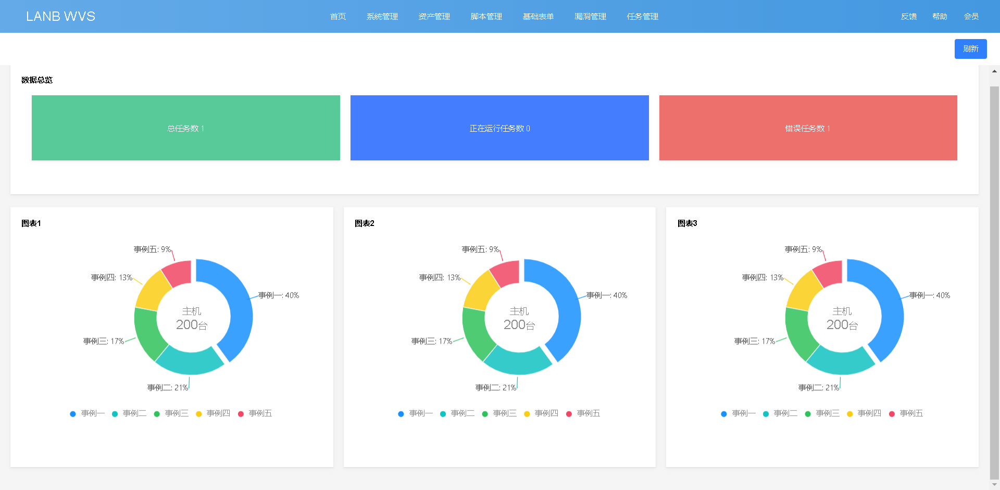
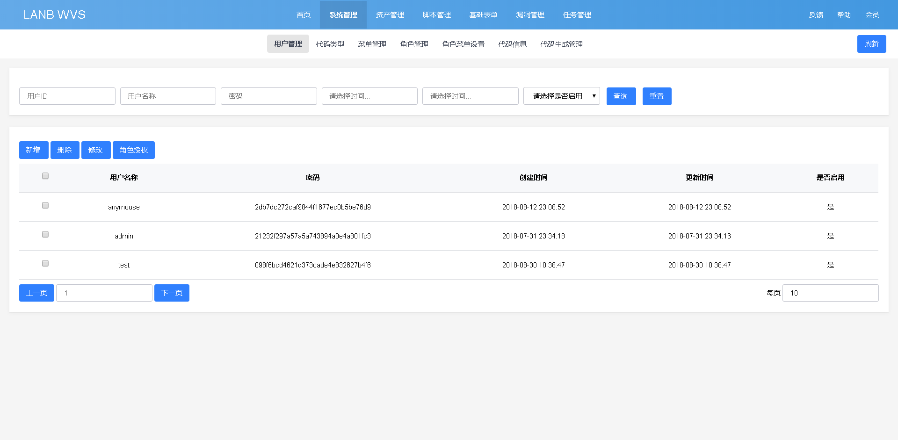

# lanb-wvs

一个正在孵化的漏扫平台；漏洞扫描平台。

## 前言
本项目是立足于网络安全的的WEB扫描平台，定位是基于云服务的微扫描平台。

整合安全资源，提供一个庞大的知识库。

## 面向群体
- 安全团队
- 安全企业
- 安全外包公司

## 面向个人
- 安全研究人员
- 驻场人员
- 安全团队管理

## 展示

### 首页

### 基础表格

## 关于我们
对本项目有兴趣者，欢迎加群讨论：

* QQ群：82667033 
* QQ：425343603

