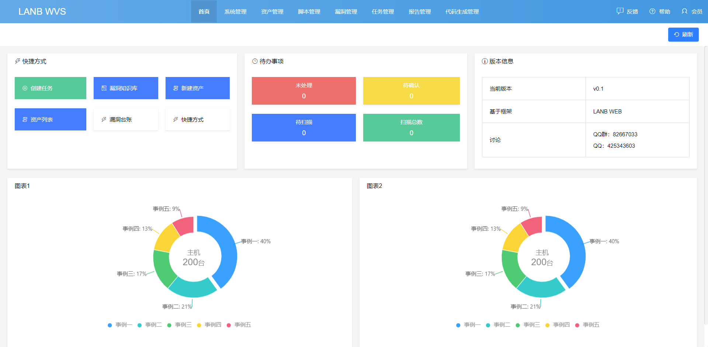
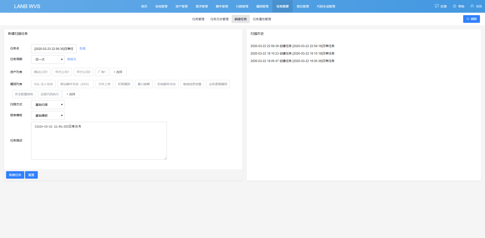
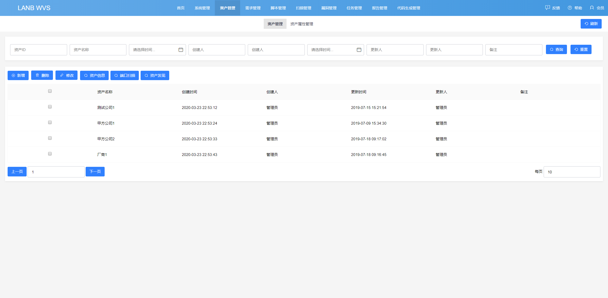

# lanb-wvs

一个正在孵化的漏扫平台；漏洞扫描平台。

## 前言
本项目是立足于网络安全的的WEB扫描平台，定位是基于云服务的微扫描平台。

整合安全资源，提供一个庞大的知识库。

## 面向群体
- 安全团队
- 安全企业
- 安全外包公司

## 面向个人
- 安全研究人员
- 驻场人员
- 安全团队管理

## docker部署

### 前提
安装好docker和docker-compose服务  

根目录下执行命令

```shell
# Windows
docker-compose run --build
# 查看IP地址
ipconfig

# Centos7
# 正常启动
docker-compose up
# 后台执行启动
docker-compose up -d
# 查看ip地址
ip a

```

访问应用 http://IP地址:80/

## 基础展示

### 首页


### 基础表格


## 驻场工程师

### 首页


### 创建任务


### 资产维护


### 安全管理员


## 基础展示

## 反馈交流
对本项目有兴趣者，欢迎加群讨论：


* QQ：425343603